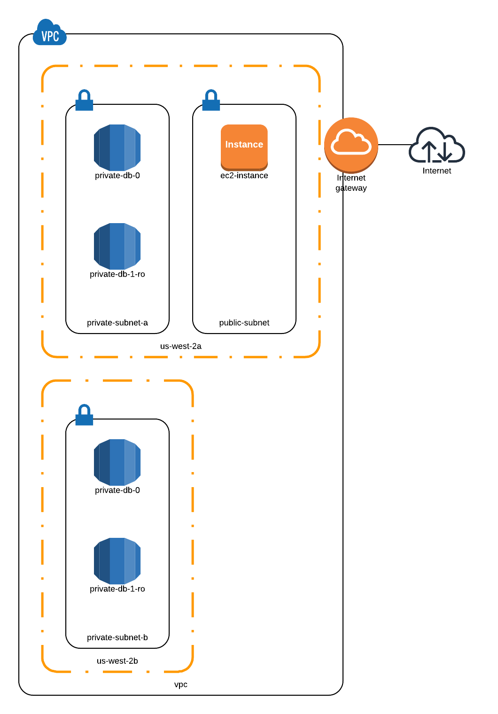

# Terraform and AWS Lab

Lab for the BYU IT&C 347 final project.

## Overview

Terraform allows users to create infrastructure as code before applying it to cloud services such as AWS. Network administrators can code the infrastructure they want to deploy and save it so they can easily replicate deployments. Since the infrastructure is stored as code, you also get other benefits that come with writing code such as being able to use version control and IDE support.

### Concepts

This is a lab to practice the follow techniques:

- Managing network infrastructure with infrastrucutre-as-code tools such as [Terraform](https://terraform.io).
- Accessing subnets not connected to the internet via a public bastion.
- Understanding AWS concepts.

## Objectives

- Create a bastion to access the RDS cluster
- In a separate, private subnet, create and Aurora RDS cluster and only be able to connect to it from your EC2 instances. This instance will contain two encrypted databases: one for writing/reading and one for read-only.
- Create the necessary VPC(s), subnet(s), security group(s), etc. to enforce these access controls.

## Lab Architecture

The following picture shows the architecture we are going to create with Terraform:

## Pass Off

Show the TA that you can connect to your EC2 instance via the internet and then your RDS cluster from your EC2 instance.

## Additional Resources

- [Terraform Introduction](https://www.terraform.io/intro/index.html)
- [Terraform Tutorial](https://learn.hashicorp.com/terraform)

## Improvements

- Restrict SSH access to the EC2 instances from the IT VPN. The reason we didn't do that for this lab is because we didn't know the IP range or have access to the IT VPN.